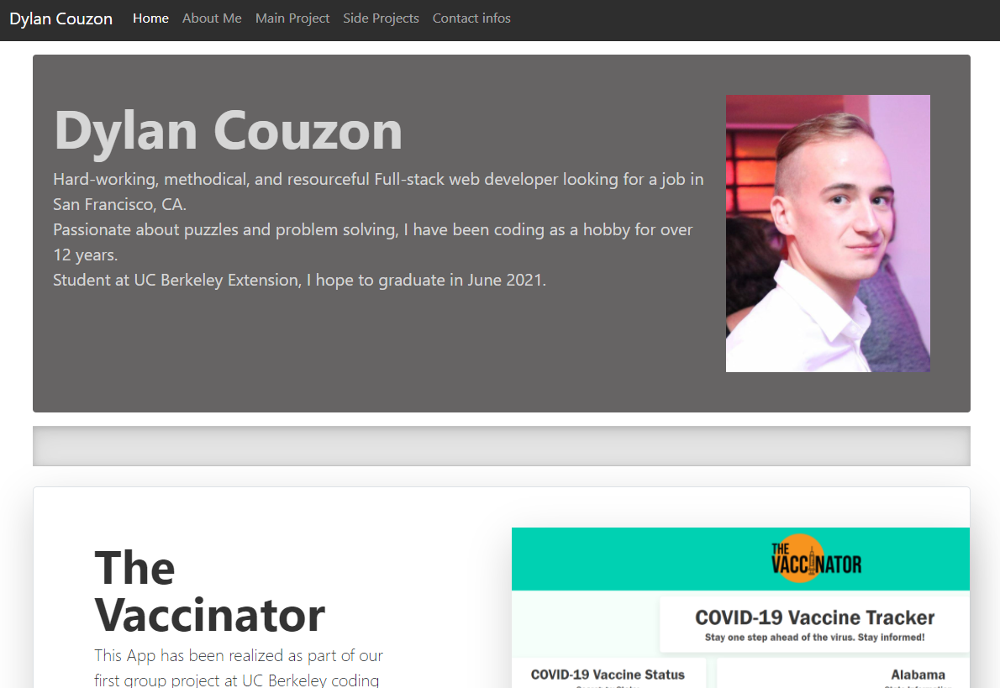

# Portfolio-2
Portfolio #2 for UC Berkeley coding Bootcamp

[](https://opensource.org/licenses/MIT)



## Technologies Used
- HTML - Creates text and differents elements 
- CSS - styles html elements on page
- GitHub - hosts and deploys the pages
- Bash - Terminal
- Bootstrap - CSS framework

## Summary 
This is my second Portfolio realized for UC Berkeley Coding Bootcamp
The App gives you access to a brief description of myself, my most recent project, some secondary projects, and my contact infos.


## Code Snippet  
```css
.b-divider {
    height: 3rem;
    background-color: rgba(0, 0, 0, .1);
    border: solid rgba(0, 0, 0, .15);
    border-width: 1px 0;
    box-shadow: inset 0 .5em 1.5em rgba(0, 0, 0, .1), inset 0 .125em .5em rgba(0, 0, 0, .15);
  }
```
This code Snippet represents the integrality of the content of my CSS file. This is a divider element that I use to separate different sections.
All the styling & personalization has been applied through the CSS Framework.

## Deployed Link

[See Live Site](https://dylancouzon.github.io/Portfolio-2/)


## Author Links
[LinkedIn](https://www.linkedin.com/in/dcouzon/)
[GitHub](https://github.com/Dylancouzon)
